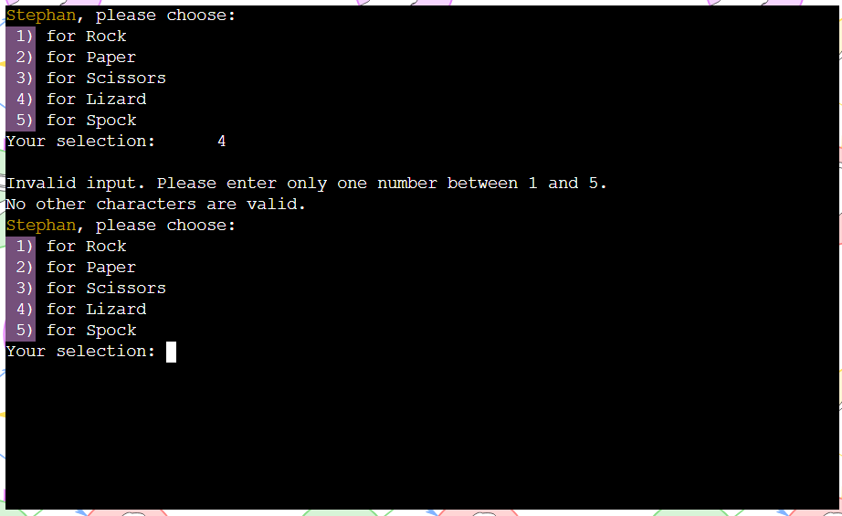

# ReadME
Portfolio Project 3 – User SureDeveloping – Code Institute

## Project overview
### Introduction to the project
The created programme in this project is a Rock Paper Scissors online game. In this created version the items Lizard and Spock have been added to have more variety in the game. This variant is known from the TV series the big band theory. The game is based on chance and luck. It can be played against the computer.More information about the general game idea can be found on Wikipedia. 
[Link to Wikipedia](https://en.wikipedia.org/wiki/Rock_paper_scissors) Leads to the Wikipedia page of Rock paper scissors.

### Contents
[Project overview](#project-overview) \
[Introduction to the project](#introduction-to-the-project) \
[Contents](#contents) \
[Game play](#gameplay) \
[User experience (UX)](#user-experience)\
[Target audience](#target-audience)\
[User story](#user-story)\
[Flow Chart](#flow-chart) \
[Features](#features) \
[Technologies used](#technologies-used) \
[Languages used](#languages-used) \
[Software used](#software-used) \
[Libraries used](#libraries-used) \
[Languages used](#languages-used) \
[Deployment](#deployment) \
[Testing](#testing) \
[Manual testing](#manual-testing) \
[Slack peer group rewiew](#slack-peer-group-rewiew) \
[Validator tests](#validator-tests) \
[Solved bugs](#solved-bugs) \
[Known unsolved bugs](#known-unsolved-bugs) \
[Credits](#credits) \
[Code used](#code-used) \
[Content on the website](#content-on-the-website) \
[Learning materials](#learning-materials) \
[Acknowledgments](#acknowledgments)

### Gameplay
First, the player is asked to enter his name. This allows the computer to address the player directly. When a game has been started, the player chooses by entering a number between the items Rock, Paper, Scissors, Lizard or Spock. At the same time, the computer also selects its object using a random function. The computer then chooses who has won and displays this. 

Here are the criteria according to which the computer chooses: 
Scissors cuts Paper  
Paper covers Rock  
Rock crushes Lizard  
Lizard poisons Spock  
Spock smashes Scissors  
Scissors decapitates Lizard  
Lizard eats Paper  
Paper disproves Spock  
Spock vaporises Rock  
Rock crushes Scissors  

The player can play as often as he likes. It is possible to quit the game after each round.

## User experience (UX)
### Target audience of the website
- People who like Browsergamers.
- People who want to pass some free time.
- People who want to play the game Rock-Paper-Scissors-Lizard-Spock against the computer.

### User story
As a first time user of the game, you want to:
- Play a bug-free game.
- Play a self-explanatory game.
- Be able to navigate easily over the terminal window.
- I would like to be able to read the rules of the game.

As a frequent user of the website, you want to:
- Repeat the game experience.
- Improve the last game result.

Objectives of the website operator is to:
- Provide an easy to navigate and to play game.
- Provide a feedback of all user inputs.
- Provide an error free game.
- Provide an entertaining diversion to pass the time.

How this requirements are met:
- The game will be free to play.
- There will be a welcome screen from which the player can navigate.
- All important elements will be shown in the terminal.
- A response is given to every user input, especially if the input is not expected by the computer.
- The player can display the rules.
- There is always the possibility to quit the game.

### Flow Chart

At the beginning I had planned to integrate a highscoure list into the project. This should be able to save the data in a googlesheet and also be able to access it again. I had the feature almost ready for the upcoming release date. Unfortunately, the API error code 429 occurred during the test phase in which I formatted the table. This is generated by google when too many accesses occur in a short time. Using a new sheet and waiting a few hours did not help. Since I am dependent on my google accout with that APIs working again to ensure the secure function of the feature, I have decided to delete it again. It is too risky to plan with an unsafe feature just before submitting it. It may be added in the future.

The Flowsharts with highscore feature created with draw.io:

The reworked flow chart without the highscore feature.

### Features
Start Screen:
 
On the start screen, the player is greeted with the ASCII font Rock Paper Scissors Extended. You will then be asked to enter your name.

Only letters are allowed when entering names. If something else is entered or the field is left blank, a message appears: The text field must not be left blank and only letters are permitted!

If a valid name has been entered, the player will be addressed personally by name. The program is briefly explained and a menu appears. Here the player can choose what he wants to do next by entering the keys. Entering the letter P starts the game. Entering the letter R takes the player to the rules of the game. If the player enters Q, the game ends.

If the input is not valid, meaning everything except P, R or Q, an error message is displayed again. The player is prompted once again to select one of the three options, as other entries are not permitted. 

Rules Screen:
The rules are printed slightly slower using the time method. This way the long text does not appear so abruptly and there is time to read it. At the end of the text, the player can start the game with P or end the program with Q.

The menu also ensures that only P or Q can be entered. For other entries, the player receives a message that only P or Q are permitted.

Play the Game Screen:

If the player chooses P, the game starts and he is taken to the play screen. By entering a number, the player is asked to choose 1 for Rock, 2 for Paper, 3 for Scissors, 4 for Lizard or 5 for Spock.

If the player enters anything other than a number between 1 and 5, the player is shown an error message. And he is asked to repeat his entry.

Once the player has made a valid selection, his choice is compared with that of the computer and the winner is announced. The computer's choice and the player's choice are displayed.  If the player has won, this is displayed. At the same time, he sees an overview of how many rounds he has played, how many he has won and how many he has lost. He can also see how many were undecided. In addition, reasons are always given as to why he won or lost. 
He is also asked at the end whether he wants to play another round, in which case he should press P, or whether he wants to stop, in which case he should press Q.

This is a screen when the player wins:

This is a screen when the player loses:

This is a screen of a draw:

When the player selects Q, he will be taken to a farewell screen:

Future Implementations:
- Highscore list:  
As previously mentioned in the Flowsharts section, it was planned to add a highscore list to the game. So you can compare your results with the results of others. You can also see your old entries and results. 
- Login function:  
A login function allows the player to beat and overwrite his old highscore list. This prevents a player from appearing more than once in the highscore list with the same name.
- Sound Effects:  
 As a further improvement, sound effects could be added to the game. This would give your player an even better experience and also appeal to the sense of hearing.

## Technologies used
### Languages used
Python is used for the project. For the landingpage HTML, CSS were used to customised the look.
### Software used
Draw.io - To create a Flow Chart.  
Gitpod - To code the project.  
Git - For version control.  
Github - To store to project.  
Heroku – to deploy the project.  
Ci Python Linter – To validate the python code.  
Deepl - For translating text.  

### Libraries used
- colorama:  
I used colorama to set color accents in the terminal text. In particular, the permissible values that must be entered by the user were marked here. In addition, changing values were marked. So variables that the computer updates during the game such as rounds played, won, lost and drawn games.

- art:  
The Art librarie was used to provide the start screen with an ASCII font. This makes the start screen more impressive.

- os:  
The os module was used to empty the terminal and make the program navigation clearer. Data that is no longer relevant is removed. 

- random:  
The random module is used to let the computer make a random selection between Rock, Paper, Scissors, Lizard or Spock.

- time:  
The time module is used to make the rule appear slower.

## Deployment
Forking???
Playing on a Local machine or via Gitpod Terminal:     CHECKEN 

The project was coded with gitpod, stored on github and then deployed on Heroku. 
That is how the deployment was done:
1.  Create a requirements.txt with the terminal comand: pip3 freeze > requirements.txt
2.  Pushed the latested code and requirements.txt on to Github.
3.	Log in to Heroku or create an account first.
4.	Click on the New Button on the dashboard in the top right corner.
5.	Click on "Create new app".
6.	Select the relevant region. In my case, I chose Europe.
7.  Select an app name that does not yet exist on heroku.
8.	Click on the "Create app" button.
9.	Click on the settings tab.
10.	Scroll to the buildpacks and click on "add buildpack," select "Python," and click "Add Buildpack".
11.	Repeat last step and add "node.js" buildpack. 
    IMPORTANT First the python buildpack must be displayed, then the pack from node.js. It can be moved via drag and drop. 
12.	Click on the deploy tab.
13.	Click on Github as the deployment method.
14.	Search for the repository name and click on conncet.
15.	Select Enable Automatic Deploys"
16. Click on "Deploy Branch"
17. Click on the "View" button which leads to the deployed app

## Testing
The page was tested on different ways and different errors came to light.
### Manual testing
I have tested all input options, valid input and non-valid input by the user. These tests were carried out throughout the entire project process. Finally, no more errors occurred. The detailed error messages to the user are also explained in the features section. A description of the bugs can be found in solved and unsolved bugs.

### Slack peer groupe rewiew
I have not yet received an answer.
### Validator tests
CI Python Linter:
Common errors that occurred were:  
E231 missing whitespace afte  
E501 line too long  
W291 trailing whitespace  
E128 continuation line under-indented for visual indent  
E225 missing whitespace around operator  
E302 expected 2 blank lines  
W293 blank line contains whitespace  
E124 closing bracket does not match visual indentation  
E271 multiple spaces after keyword  
W292 no newline at end of file  

All bugs could be fixed:

### Solved bugs
I tried to check several conditions at the same time with a while loop. So: "while not player_choice == "1" or not "2" or not" . This was the wrong approach. The player_choice function was modified with a try and expect block.

At first I had not made the variables won_games, lost_games, played_games and drawn_games global. This way they could not be accessed outside the find-winner function.

In addition, I had formatted an f string incorrectly so that the variables were not displayed correctly in the terminal at first. Improving the formatting could fix this.

The ASCII font of the start screen was initially too large for the terminal. This was detected after deployment. By trying several fonts, another suitable combination could be found.

I had forgotten to add a while loop to the main_menu and the end_game function. Therefore several wrong user inputs were not handled correctly and the programme stopped. Because of the while loops the user is asked again until the answer is valid.

### Known unsolved bugs
- As already described in the flow chart section, I had planned to create a highscore list as a feature in the first release. Unfortunately I had an error in connection with the google API, API error code 429 shortly before the release.  Since it was not foreseeable when exactly google would lower or raise the request limit, this feature will have to be added later. 

- There are no other known unsolved problems.

## Credits
### Code used
- I love sandwhiches walkthrough projekt - Here I have oriented myself on how to work with googlesheets. This was necessary for the highscoure function, which, as described in the flowchart chapter, is not yet available in this version. 
- I have informed and inspired myself about some functions in Youtube tutorials. The videos I watched are listed under Learning materials.

### Content for the project
The content of this project was written by Stephan Sure. I used wikipedia for general information about the game. The image for the landing page is also from Wikipedia.

### Learning materials
- All content from Online Course in Full Stack Software Developmen especially videos about Portfolio Project 3 and ReadME from Code Instituet

- [thehelloworldprogram](https://thehelloworldprogram.com/python/python-game-rock-paper-scissors/ ) To get a basic idea about the program

- [W3Schools](https://www.youtube.com/watch?v=I9h1c-121Uk&t=37s ) Information about the input function

- [W3Schools](https://www.w3schools.com/python/ref_string_isalpha.asp ) Information on the isalpha method

- [W3Schools](https://www.w3schools.com/python/ref_string_strip.asp#gsc.tab=0 ) Information on the string method

- [python-lernen](www.python-lernen.de/python-modul-os.htm) Information on the os module

- [geekforgeeks](www.geeksforgeeks.org/clear-screen-python/) Information on the os module

- [youtube](https://www.youtube.com/watch?v=HcqgHbvN0EQ) Leads to youtube, with a video about the random module

- [youtube](https://www.youtube.com/watch?v=46yolPy-2VQ) Leads to youtube, with a video with basic information on python

- [stackoverflow](https://stackoverflow.com) Leads to stackoverflow website.

- [W3Schools](https://www.w3schools.com/python/) Leads to W3Schools website.
- [geekforgeeks](https://www.geeksforgeeks.org/python-programming-language/) Leads to geekforgeeks website.

### Acknowledgments
I like to thank the follow persons for the help during the project:
- My Code Institute mentor Spencer Barriball.
- The Tutor Support team at Code Institute.
- Slack pear groupe.
- To all people who make their knowledge available for free in the internet, especially on youtube.

**This project is for educational use only and was created for the Code Institute course Full stack software development by Stephan Sure.**